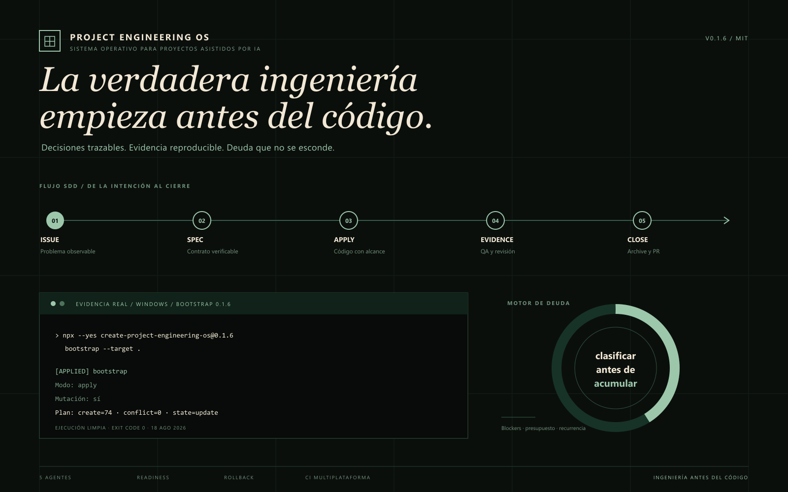

<div align="center">

# Project Engineering OS

**La verdadera ingeniería empieza antes del código.**

Una base neutral para organizar proyectos construidos con ayuda de agentes de IA.

[Inicio rápido](#inicio-rápido) · [Documentación](docs/README.md) ·
[Paquete npm](https://www.npmjs.com/package/create-project-engineering-os) ·
[Issues](https://github.com/IgnacioBarEsp/project-engineering-os/issues)

</div>



## Qué es Project Engineering OS

Project Engineering OS prepara un repositorio con las piezas que normalmente se improvisan cuando un
proyecto empieza a crecer:

- gobernanza e instrucciones compartidas para agentes;
- Spec-Driven Development con OpenSpec fijado;
- criterios de entrada y cierre para cada cambio;
- evidencia, recuperación y rollback;
- control de deuda técnica verificable;
- documentación y validaciones reproducibles.

No decide qué producto vas a construir ni instala React, Expo, una base de datos o un proveedor cloud.
Primero prepara el entorno de ingeniería; el producto y su arquitectura se descubren después.

## Cómo funciona

```text
issue -> enrich -> Definition of Ready -> spec -> apply -> QA
      -> revisión adversarial -> deuda -> archive -> PR
```

1. **El problema queda escrito.** Un issue conserva la solicitud original y añade criterios observables,
   riesgos, dependencias, evidencia y rollback.
2. **La intención se vuelve contrato.** OpenSpec describe el comportamiento con requirements y escenarios
   comprobables antes de implementar.
3. **El cambio avanza por tareas pequeñas.** Cada tarea se completa únicamente cuando existe evidencia.
4. **El resultado intenta refutarse.** QA y revisión adversarial buscan fallos, no solo una salida verde.
5. **Lo pendiente se gobierna.** El motor de deuda clasifica hallazgos y puede pausar el plan correcto antes
   de que la deuda siga creciendo.

## Qué incorpora

### Un núcleo común para cinco agentes

Genera instrucciones para **Claude Code, Codex, Cursor, GitHub Copilot y OpenCode**. Cada harness recibe
solo las capacidades que puede representar; una degradación documentada nunca se presenta como paridad
nativa. Consulta la [matriz de compatibilidad](docs/COMPATIBILITY.md).

### SDD y evidencia

OpenSpec permanece fijado a una versión exacta. Los gates de readiness comprueban issue, alcance,
dependencias, evidencia, intervención humana, costos, licencias y rollback. Los estados posibles conservan
su significado: PASS, FAIL, WARN y SKIP no son intercambiables.

### Motor de deuda

Un warning o TODO es un candidato, no deuda automática. Cada cierre registra un assessment, incluso cuando
el resultado es `clean`. Blockers, recurrencia, excepciones vencidas o presupuesto agotado activan una ruta
de saneamiento. Lee [Debt Control Loop](docs/DEBT_CONTROL.md).

### Operaciones recuperables

Bootstrap, sync y upgrade generan planes, hashes y transacciones. Una ejecución interrumpida puede
reanudarse o revertirse sin usar `git reset --hard`. La [guía de recuperación](docs/RECOVERY.md) explica
los casos normales y los fallos de PR.

## Inicio rápido

Necesitas Git, npm y Node `^20.20.0 || >=22.22.0`.

### 1. Crea la carpeta y abre tu terminal

```sh
mkdir mi-proyecto
cd mi-proyecto
git init
```

### 2. Instala el núcleo

La versión explícita mantiene el bootstrap reproducible:

```sh
npx --yes create-project-engineering-os@0.1.6 bootstrap --target .
npm ci
npm run openspec:init
npm run project-os:opsx:adapt
npm run project-os:check
npm run project-os:doctor
```

El comando fue verificado desde una carpeta vacía en Windows. La suite también lo prueba en Ubuntu y
macOS. Antes de cambiar `0.1.6`, revisa el [changelog](CHANGELOG.md).

Los scripts `openspec:*` usan telemetría apagada por defecto sin cambiar tu configuración global. Puedes
elegir explícitamente otro valor con `OPENSPEC_TELEMETRY`; una invocación directa de OpenSpec queda bajo su
contrato upstream. Consulta el [triage de cadena de suministro](docs/security/SUPPLY_CHAIN_TRIAGE_2026-08-18.md).

### 3. Abre el agente que prefieras

Abre Claude Code, Codex, Cursor, GitHub Copilot u OpenCode en la raíz del repositorio y pega:

```text
Lee AGENTS.md y docs/engineering/PROMPT_00_BOOTSTRAP_ENTORNO.md. Ejecuta ese flujo usando
create-project-engineering-os@0.1.6 como versión aprobada. Comprueba el segundo run sin drift, los cinco
harnesses, OpenSpec, los gates y la recuperación. No elijas todavía el producto, framework, arquitectura,
cloud o base de datos. Detente ante cualquier autorización, costo, licencia, autenticación o mutación
remota y explícame qué necesitas. Al terminar, resume PASS/FAIL/WARN/SKIP y pregúntame si quiero preparar
el relevo hacia PROMPT_01_DISCOVERY_PROYECTO.
```

El agente debe completar el trabajo local por sí mismo. Las instrucciones manuales son un fallback cuando
las pides o una automatización no puede continuar.

### ¿Ya tienes un repositorio?

Trabaja desde una rama y un árbol limpio. Revisa primero el plan sin escribir:

```sh
npx --yes create-project-engineering-os@0.1.6 bootstrap --target . --dry-run
npx --yes create-project-engineering-os@0.1.6 bootstrap --target .
npm ci
npm run project-os:check
```

Una colisión humana detiene la operación antes de sobrescribir. Consulta el
[modelo de ownership](docs/architecture/OWNERSHIP.md).

## Elige la documentación que necesitas

- **Quiero empezar desde cero:** [Guía del usuario](docs/USER_GUIDE.md).
- **Quiero saber qué ruta corresponde a mi carpeta:** [Clasificador read-only](docs/ONBOARDING_PLAN.md).
- **Necesito ejecutar el primer prompt:** [Prompt 00](docs/prompts/PROMPT_00_BOOTSTRAP_ENTORNO.md).
- **El entorno ya está aprobado:** [Prompt 01 y discovery](docs/prompts/PROMPT_01_DISCOVERY_PROYECTO.md).
- **Quiero entender un fallo o revertir:** [Recuperación](docs/RECOVERY.md).
- **Necesito operar deuda técnica:** [Debt Control Loop](docs/DEBT_CONTROL.md).
- **Mantengo o publico el paquete:** [Releases](docs/RELEASES.md) y
  [upstream/consumidores](docs/UPSTREAM_CONSUMERS.md).

El [índice completo](docs/README.md) organiza las rutas por objetivo y nivel de detalle.

## Comandos habituales

Estos son los comandos que conviene reconocer después del inicio rápido:

```sh
project-os sync --target . --check
project-os doctor --target . --json
project-os onboarding-plan --target . --answers onboarding-answers.json --json
project-os readiness-check --phase propose --issue 123 --target .
project-os readiness-check --phase archive --change mi-change --run-local --target .
project-os debt check --root .
project-os upgrade --target . --check
project-os rollback --target . --transaction <id>
```

Los comandos con `--check`, `doctor`, `onboarding-plan` y readiness diagnostican sin reparar ni autenticar.
Una mutación
requiere un comando explícito y conserva recuperación.

## Estado actual y próximos pasos

La versión actual instala el núcleo universal y mantiene inactivos los perfiles de producto. No activa
skills ni servidores MCP por defecto. MVVM, CI/CD del producto, Playwright, IA, UI, offline/sync y cloud se
deciden después del discovery.

El clasificador read-only de onboarding ya está implementado en `main`: detecta evidencia, acepta cinco
respuestas y emite una ruta/estado versionado sin escribir. Llegará en la siguiente versión minor; npm
`0.1.6` todavía no lo incluye. La [guía del clasificador](docs/ONBOARDING_PLAN.md) separa esta pieza de la
orquestación de prompts y de los trackers remotos, que siguen pendientes.

## Seguridad, licencias y costo

El runtime usa licencia MIT y no tiene dependencias de producción. Las dependencias de desarrollo y
notices están en [THIRD_PARTY_NOTICES.md](THIRD_PARTY_NOTICES.md). El núcleo no compra servicios ni activa
proveedores de pago. Consulta [costos, licencias y lock-in](docs/COSTS_AND_LICENSES.md) antes de extenderlo.

<details>
<summary><strong>English summary</strong></summary>

Project Engineering OS is a neutral engineering foundation for repositories built with AI coding agents.
It installs shared governance, pinned OpenSpec SDD, readiness gates, reproducible evidence, transactional
recovery and a technical-debt control loop without choosing the product stack.

The current release supports Claude Code, Codex, Cursor, GitHub Copilot and OpenCode with explicit native,
generated, documented or unsupported capability levels. Product architecture, CI/CD, UI, AI providers,
cloud and integrations remain conditional until discovery.

Start with the [quickstart](#inicio-rápido), then use the generated Prompt 00 to verify the engineering
environment. Source `main` now includes the read-only `onboarding-plan` classifier; npm `0.1.6` does not.
Prompt orchestration, persistence and remote tracker setup remain future changes.

</details>

## Autor

Desarrollado por [Ignacio Barboza Espinoza](https://github.com/IgnacioBarEsp), desarrollador de software
junior enfocado en React Native, TypeScript y Node.js. Construí este proyecto aplicando SDD, automatización
de pruebas, UX/UI e ingeniería asistida por IA para aprender y mantener el proceso tan cuidado como el
código.

Contacto: [IgnacioBar.esp@gmail.com](mailto:IgnacioBar.esp@gmail.com)
