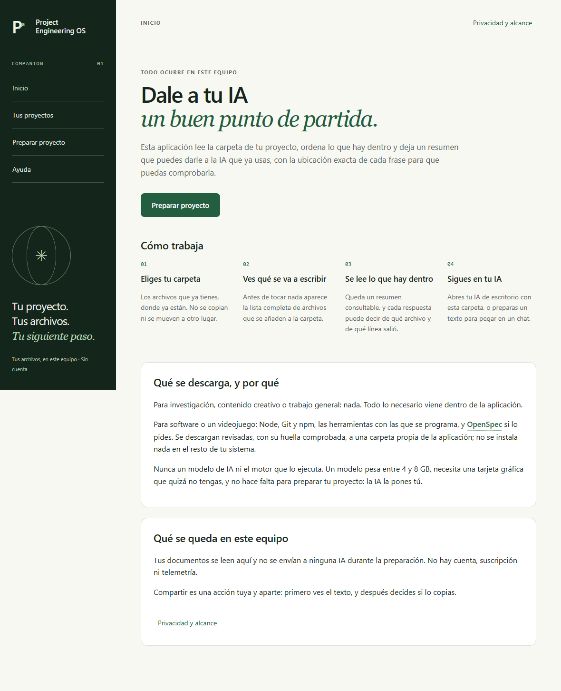

<div align="center">

# Project Engineering OS

**Dale a tu IA un buen punto de partida.**

Prepara tu proyecto, encuentra su contexto y continúa con la IA que ya usas.

[Descargar Companion para Windows](https://github.com/IgnacioBarEsp/project-engineering-os/releases/tag/companion-v0.1.0) ·
[Empezar](docs/USER_GUIDE.md) · [Documentación](docs/README.md) · [Estado del proyecto](docs/PROJECT_STATUS.md)

</div>

## Tu proyecto, con una forma de trabajar clara

Elige la carpeta donde trabajas y cuenta qué quieres hacer. Companion te muestra qué va a preparar,
organiza contexto con referencias a tus archivos y te ayuda a continuar desde ahí. Sirve para investigación,
software, videojuegos, contenido y trabajo general; cada recorrido prepara lo que le corresponde.

La idea nació al querer llevar la forma de trabajar de mi propio proyecto a otros: entender antes de
cambiar, dejar claras las decisiones y comprobar el resultado. El método se adapta a tu trabajo y a tus
herramientas. Los archivos y decisiones que ya tienes se revisan antes de añadir algo.

## Empieza con Companion

1. Descarga **Companion 0.1.0 para Windows x64** desde [Releases](https://github.com/IgnacioBarEsp/project-engineering-os/releases/tag/companion-v0.1.0).
2. Revisa el archivo e instálalo siguiendo la [guía de instalación](docs/companion/INSTALLER.md).
3. Abre la app, elige tu carpeta y explica el objetivo. Revisa el plan antes de prepararla.
4. Comprueba el resultado y continúa con tu IA: desde una aplicación compatible o copiando el contexto que revisaste.

No necesitas preparar Node, npm o Git por tu cuenta para empezar con la app. Cuando un proyecto de
software necesita herramientas, Companion muestra qué descargará y dónde antes de pedirte que continúes.
No descarga modelos de IA.

El instalador **no tiene certificado de editor**: Windows puede advertirte al abrirlo. Comprueba el SHA-256
publicado; un hash coincidente verifica el archivo, no sustituye la firma del editor.

**Estado al 14 de septiembre de 2026:** la descarga sigue en 0.1.0. La nueva navegación, las instrucciones
adaptadas y otras mejoras ya están integradas en el código, pero aún no en un instalador nuevo.
[Consulta qué está publicado y qué falta](docs/PROJECT_STATUS.md).

## Así se ve el Companion actual



Captura del código integrado `0c632a3`, tomada el 14 de septiembre de 2026 en una prueba real del
renderer en navegador. **No es una captura del instalador 0.1.0.**
[Procedencia y alcance](docs/companion/SCREENSHOTS.md).

## Qué te ayuda a hacer

- **Empezar con lo que ya tienes.** Revisar tu carpeta y conservar archivos existentes.
- **Encontrar de dónde sale una respuesta.** Buscar en texto, PDF con texto y DOCX, con línea, página o párrafo.
- **Dar contexto a tu IA.** Revisar las instrucciones y los fragmentos antes de copiarlos.
- **Trabajar por cambios comprobables.** En software, preparar instrucciones, OpenSpec, verificaciones y recuperación.
- **Retomar el proyecto.** Consultar lo preparado y detectar cuándo necesita una nueva comprobación.

Un PDF escaneado necesita reconocimiento de texto antes de poder buscarlo. Los formatos no leídos se
señalan. Abrir un chat web no le entrega automáticamente tus archivos.
La [guía del usuario](docs/USER_GUIDE.md) explica el recorrido y los límites.

## El método que se lleva a cada proyecto

Para un cambio de software, el recorrido es:

```text
entender la solicitud → acordar la spec → implementar → comprobar
                    → revisar riesgos y deuda → cerrar por PR
```

Una *spec* describe qué debe hacer el cambio y cómo comprobarlo. OpenSpec conserva ese acuerdo; las tareas,
pruebas y revisión ayudan a que el resultado coincida. Si queda un problema, se registra y se decide cómo
atenderlo. [Conoce el flujo SDD y sus controles](docs/UPSTREAM_OPERATIONS.md).

Las *skills* son guías de trabajo para el agente; MCP permite conectarlo con herramientas. Se evalúan según
lo que necesita el proyecto, sus permisos, licencia y compatibilidad. El núcleo incluye un
[catálogo revisable](docs/TOOL_CATALOG.md), no una instalación automática de todas las herramientas de
un proyecto de referencia. La [matriz de compatibilidad](docs/COMPATIBILITY.md) distingue instrucciones generadas de
integraciones realmente verificadas.

## Si prefieres la terminal

El núcleo **0.5.0** sigue disponible para automatización y para Windows, macOS y Linux.
Necesitas Git, npm y Node `^20.20.0 || >=22.22.0`. En una carpeta Git vacía:

```sh
npx --yes create-project-engineering-os@0.5.0 bootstrap --target .
npm ci
npm run openspec:init
npm run project-os:opsx:adapt
npm run project-os:check
npm run project-os:doctor
```

Después, abre tu agente y sigue el [prompt router](docs/prompts/PROMPT_ROUTER_INICIO.md),
[Prompt 00](docs/prompts/PROMPT_00_BOOTSTRAP_ENTORNO.md) y
[Prompt 01](docs/prompts/PROMPT_01_DISCOVERY_PROYECTO.md) cuando corresponda.
La [guía CLI](docs/CLI_GUIDE.md) cubre el inicio completo, carpetas existentes y decisiones manuales.

```sh
project-os upgrade --target . --check
project-os debt check --root .
project-os rollback --target . --transaction <id>
```

Los comandos de comprobación leen sin reparar. El rollback es una acción explícita con verificación de
ownership. [Recuperación](docs/RECOVERY.md) explica cuándo usarlo.

## Cómo encajan la app y el núcleo

Companion es la entrada visual. El núcleo hace la preparación de ingeniería que también se puede pedir
por CLI. Bootstrap es el nombre de esa preparación inicial; npm distribuye paquetes y forma parte de las
herramientas administradas. No son cuatro productos que debas aprender para usar la app.
[Mapa del repositorio y qué sigue siendo necesario](docs/REPOSITORY_MAP.md).

## Privacidad, límites y desarrollo

La preparación básica es local, sin cuenta propia ni suscripción. Tus documentos no se suben
automáticamente. El código actual ofrece redacción opcional con un modelo local o proveedor propio:
revisa qué datos compartirás y el costo de ese proveedor antes de activarla.
[Privacidad del Companion](docs/companion/SECURITY.md).

El proyecto usa licencia MIT. El núcleo no tiene dependencias de producción; el Companion tiene las suyas
y su [aviso de terceros](apps/companion/THIRD-PARTY-NOTICES.md). No hay un ahorro de tiempo o dinero
general demostrado: [aquí están las mediciones y sus límites](docs/companion/EVIDENCE.md).

Para contribuir: [CONTRIBUTING](CONTRIBUTING.md), [releases](docs/RELEASES.md),
[ownership](docs/architecture/OWNERSHIP.md) y [control de deuda](docs/DEBT_CONTROL.md).
La [landing actual](https://ignaciobaresp.github.io/project-engineering-os/) sigue disponible mientras
la [nueva landing](https://github.com/IgnacioBarEsp/project-engineering-os-landing) se termina en su repositorio.

<details>
<summary>English summary</summary>

Project Engineering OS helps prepare project context and a repeatable way of working with your existing AI.
Start with the Windows Companion installer; the neutral core CLI remains available for automation on
Windows, macOS and Linux. The app and core have separate versions. See the
[current delivery status](docs/PROJECT_STATUS.md) before assuming a feature in source is in the download.

</details>

Desarrollado por [Ignacio Barboza Espinoza](https://github.com/IgnacioBarEsp).
[Contacto](mailto:IgnacioBar.esp@gmail.com).
