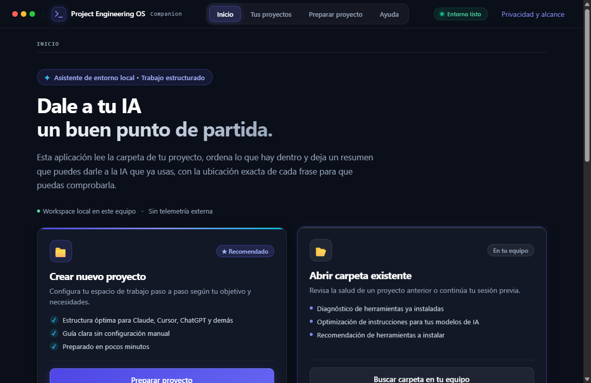
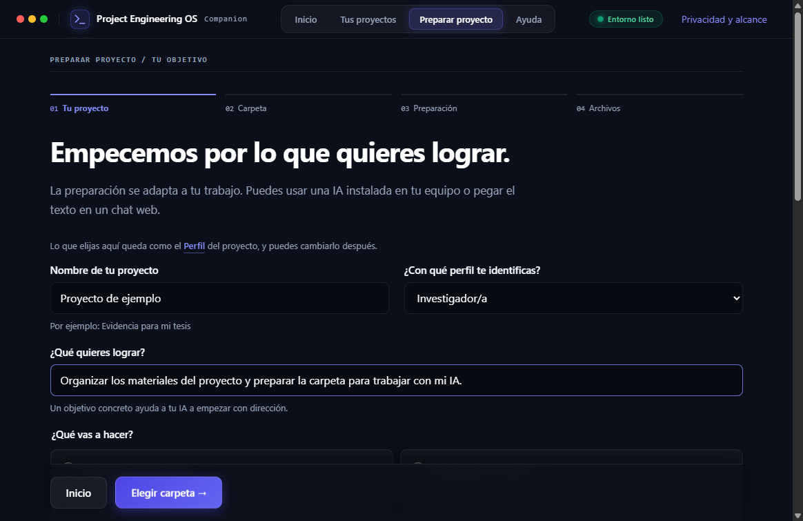
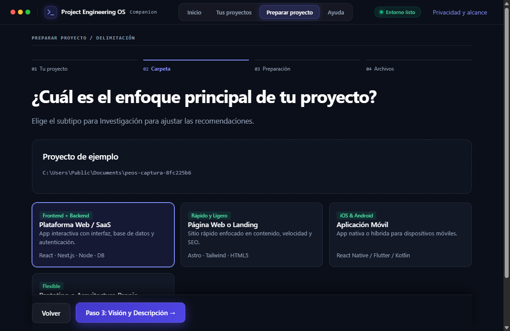
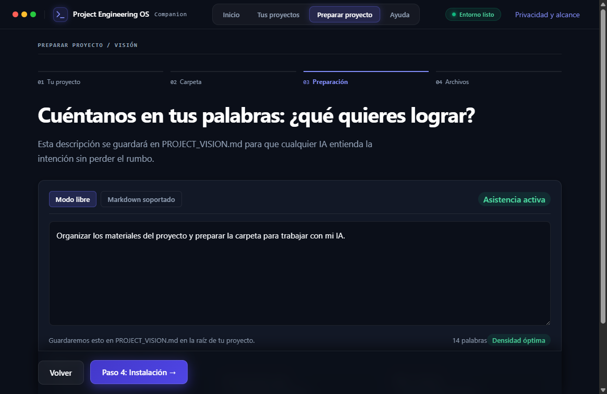
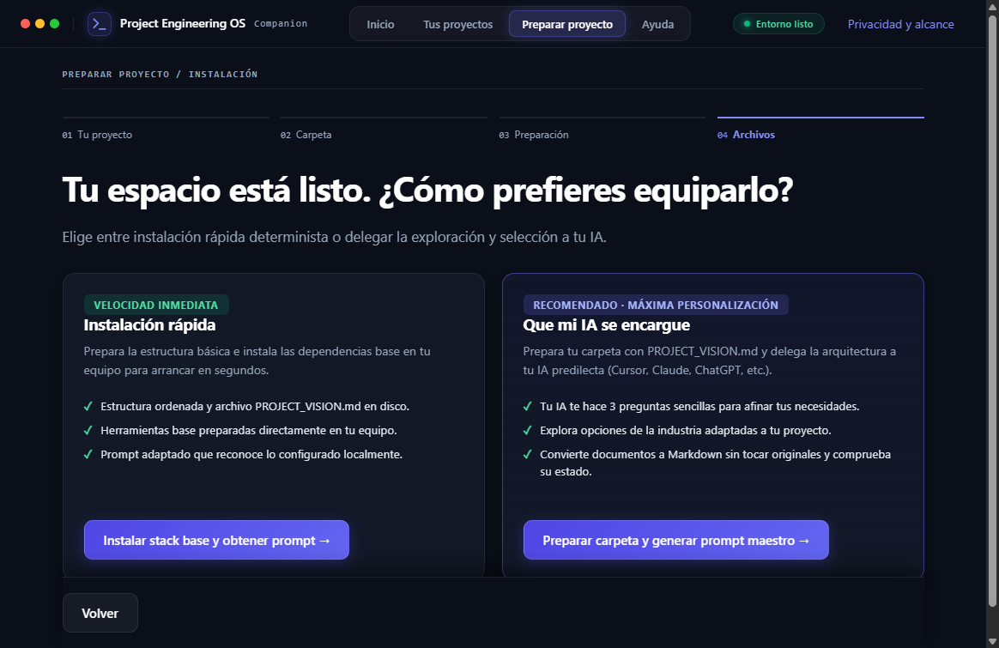
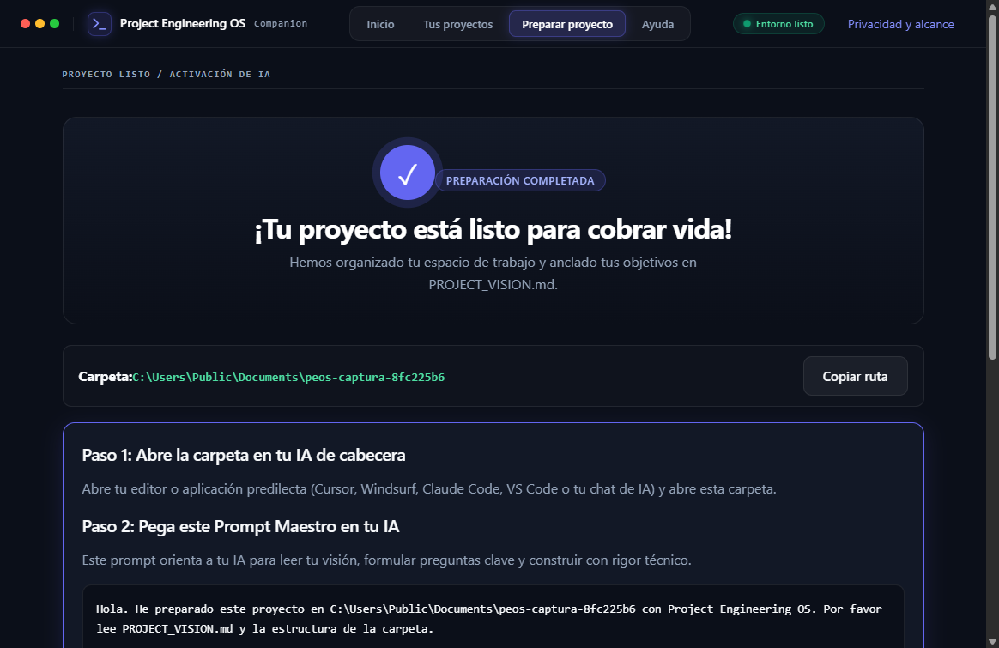

# Capturas de Companion 0.3.2

Cada imagen de esta página es la ventana real de la aplicación, ejecutada desde el código del commit que se
cita abajo. **No es una captura del instalador.** Junto a cada archivo hay un registro de procedencia
(`<imagen>.png.provenance.json`) con su commit, versión, motor, ventana, fecha y SHA-256, y `npm run check`
falla si una imagen no coincide con su registro o si es idéntica a un [prototipo de diseño](../stitch%20uxui/).

La ventana es la que abre la aplicación por defecto, 1180 × 820, que deja 1164 × 755 px CSS. Cada captura
muestra la pantalla al llegar a ella, con el scroll arriba: lo que queda más abajo, como las sugerencias de
Visión, no aparece.

## 1. Inicio

Barra superior con los cuatro destinos, la pastilla «Entorno listo» y «Privacidad y alcance». El titular
«Dale a tu IA un buen punto de partida.» y dos tarjetas: «Crear nuevo proyecto», recomendada, y «Abrir carpeta
existente».

## 2. Paso 1: tu proyecto

El indicador marca «01 Tu proyecto» de cuatro pasos. Se ven el nombre, «¿Con qué perfil te identificas?» —seis
roles, aquí el que trae por defecto, «Investigador/a»— y «¿Qué quieres lograr?»; el nombre y el objetivo son de
ejemplo. Debajo empieza «¿Qué vas a hacer?», cuyas tarjetas corta el borde inferior: esa elección, y no el rol,
es la que queda como perfil del proyecto. Fuera del encuadre siguen tres grupos más, que la captura no muestra:
la tecnología, la IA con la que vas a trabajar y cuánta guía prefieres. La barra inferior ofrece «Inicio» y
«Elegir carpeta →».

## 3. Paso 2: delimitación

El indicador marca «02 Carpeta», después de elegir la carpeta del proyecto, que aparece en su tarjeta con la
ruta pública que creó esta captura. El subtítulo dice «Elige el subtipo para Investigación para ajustar las
recomendaciones», pero las tarjetas que ofrece son las de software: «Plataforma Web / SaaS», «Página Web o
Landing», «Aplicación Móvil» y, cortada por el borde, «Prototipo o Arquitectura Propia». La primera aparece
marcada sin que nadie la eligiera. No es un recorte de la captura, es un defecto abierto:
[issue #145](https://github.com/IgnacioBarEsp/project-engineering-os/issues/145). La barra inferior ofrece
«Volver» y «Paso 3: Visión y Descripción →».

## 4. Paso 3: visión y descripción

El indicador marca «03 Preparación». El editor guarda la descripción en `PROJECT_VISION.md`, cuenta las
palabras y admite Markdown. Las sugerencias que ayudan a enriquecer el texto están debajo del editor, fuera de
esta captura.

## 5. Paso 4: instalación

El indicador marca «04 Archivos». Las dos tarjetas son las dos formas de terminar. Hoy hacen lo mismo:
guardan las elecciones y escriben `PROJECT_VISION.md`. La tarjeta de «Instalación rápida» dice que instala
dependencias base y ninguna versión lo hace todavía; eso es el
[issue #147](https://github.com/IgnacioBarEsp/project-engineering-os/issues/147).

## 6. Proyecto listo

La pantalla final muestra la carpeta preparada, «Copiar ruta» y el Prompt Maestro para pegar en tu IA. La
carpeta que se ve es la carpeta pública que la captura creó para este recorrido, no una carpeta de la persona
que ejecutó.

## Lo que se ve y está abierto

- **«Carpeta:» pegado a la ruta** en la pantalla final: la política de seguridad de la ventana bloquea los
  estilos en línea que separan esos elementos. Es parte del renderer que rehace el
  [issue #144](https://github.com/IgnacioBarEsp/project-engineering-os/issues/144), y la captura lo muestra tal
  cual.
- **Las dos formas de instalar** hacen lo mismo: [issue #147](https://github.com/IgnacioBarEsp/project-engineering-os/issues/147).
- **Subtipos que no corresponden al perfil** en el paso 2: con el perfil «Investigación», la pantalla pide
  elegir «el subtipo para Investigación» y ofrece los de software, con el primero ya marcado. Es lo que rehace
  el [issue #145](https://github.com/IgnacioBarEsp/project-engineering-os/issues/145), y la captura lo muestra
  tal cual.

## Procedencia

| Dato | Valor |
| --- | --- |
| Fuente | [Commit d744c47](https://github.com/IgnacioBarEsp/project-engineering-os/tree/d744c47ffb618543c18270312810de3a260e7eea) |
| Versión de la aplicación | 0.3.2 |
| Entorno | Ventana real de la aplicación en Windows 11, ejecutada desde el código con `electron .` |
| Motor | Electron 44.1.1, Chromium 152.0.7977.65 |
| Ventana | 1180 × 820 exterior; 1164 × 755 px CSS, `devicePixelRatio` 1 |
| Ejecución UTC | 2026-09-19T22:54:20.817Z |
| Generador | `apps/companion/scripts/capture-screenshots.mjs` |
| Sustituido | El selector de carpetas del sistema, que un script no puede manejar, y los datos de usuario, aislados en un directorio temporal |

| Imagen | SHA-256 | Bytes |
| --- | --- | --- |
| [`docs/assets/companion/home-companion.png`](../assets/companion/home-companion.png) | `1f5ec9e90f3c9549a4b2b2dc66dcfed70710e2bdebc19a755dc05625c698d775` | 106 571 |
| [`docs/assets/companion-current-home.png`](../assets/companion-current-home.png) | `60e93f5afb00f658d3f458a885f643d44ad958a3cff0b7b1f532d47ec7677bad` | 106 279 |
| [`docs/assets/companion/paso-1-perfil.png`](../assets/companion/paso-1-perfil.png) | `5d58a756c82414e2c16a4ea977dbbf0a6724021aa154de26cfced57c1dcb91a1` | 78 323 |
| [`docs/assets/companion/paso-2-delimitacion.png`](../assets/companion/paso-2-delimitacion.png) | `07e7ca92c7933162da087b2d5835b7ec5996d795cf8c19466eb418bf12311d27` | 91 258 |
| [`docs/assets/companion/paso-3-vision.png`](../assets/companion/paso-3-vision.png) | `d4e5c5aae714fe779dbe24e29e4cbd790cc8165d279f82c33da248ce868df1e1` | 76 951 |
| [`docs/assets/companion/paso-4-instalacion.png`](../assets/companion/paso-4-instalacion.png) | `1e5ab0c0b3c9537d8d4ab96735586f0b49a02dbcec0b119995075c913ed846da` | 118 913 |
| [`docs/assets/companion/proyecto-listo-activacion.png`](../assets/companion/proyecto-listo-activacion.png) | `6fa75cc1930e60179d6b962b4c4c7055a17fb72918c5163ac5581b8fada76603` | 84 849 |

Las capturas de Inicio son dos ejecuciones del mismo momento del recorrido: una para esta galería y otra para
el README. Difieren en bytes, no en contenido.

Ninguna imagen contiene datos personales ni proyectos privados. El recorrido usa un proyecto de ejemplo en una
carpeta pública que se borra al terminar.
