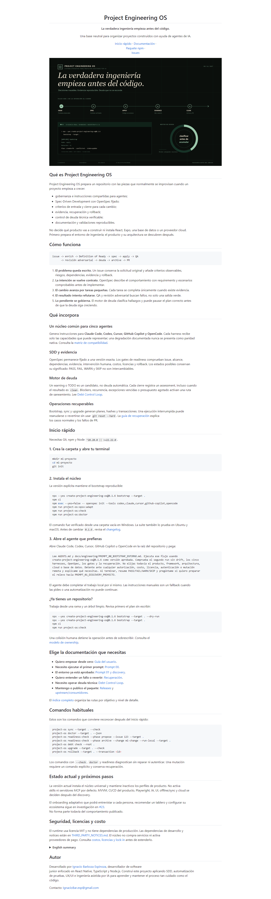
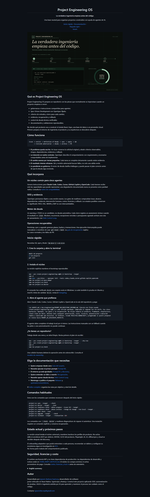
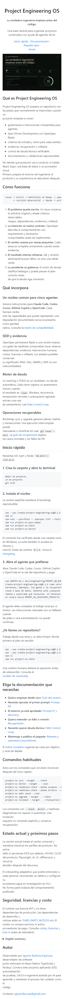
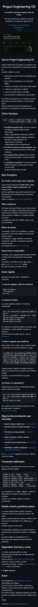
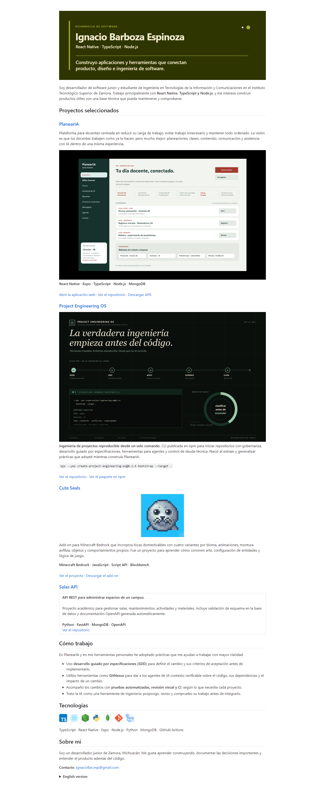
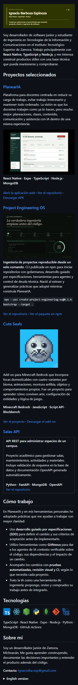

# Evidencia de render de los README

Fecha: 18 de agosto de 2026.

## Método

- Render GFM obtenido con la API de Markdown de GitHub.
- Capturas completas con Playwright 1.55 y Microsoft Edge.
- Vista de escritorio: `1440 px` de ancho.
- Vista móvil: `390 px` de ancho.
- Esquemas comprobados: claro y oscuro.
- Repositorios comprobados: Project Engineering OS y el perfil público de Ignacio Barboza Espinoza.

## Resultado

Las seis capturas conservan jerarquía, ancho útil y contraste. Los bloques de comandos mantienen saltos de
línea y desplazamiento horizontal cuando no caben. La pieza visual no cambia con el tema porque su fondo
oscuro es intencional y ofrece un límite claro en ambos esquemas.

La combinación de texto más tenue, `#73927E` sobre `#0B0F0C`, alcanza una relación de contraste de
`5.53:1`. El texto secundario de terminal verificado alcanza `5.91:1`. Ambos superan WCAG AA para texto
normal. El README usa este texto
alternativo para la pieza: “Plano de control de Project Engineering OS: el flujo SDD conecta issue, spec,
implementación, evidencia y cierre; debajo aparece una ejecución real del bootstrap y el motor de deuda”.
El perfil incluye un texto alternativo equivalente y orientado al contexto de la tarjeta.

## Capturas

### Project Engineering OS

### Perfil

